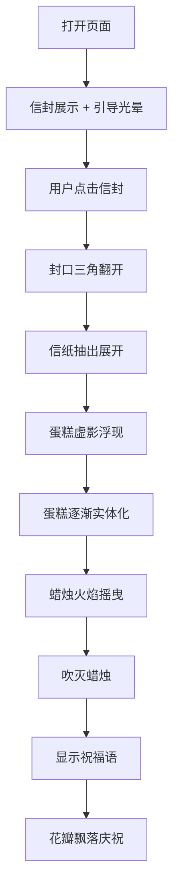

## 1. 产品概述

一个充满仪式感的生日祝福单页网页，以信封开启动画为核心交互，收信人通过点击信封逐步解锁生日惊喜——从信封展开到蛋糕浮现再到吹灭蜡烛，最终呈现温暖的祝福语。

- 主要目的：为一位名为"小猪"的女生送上一份数字化的生日祝福，营造温馨、惊喜的仪式感
- 目标用户：收信人（女性朋友/恋人），适合在生日当天通过链接分享

## 2. 核心功能

### 2.1 用户角色

| 角色 | 描述 |
|------|------|
| 收信人 | 点击信封、观看动画、接收祝福 |

### 2.2 功能模块

1. **信封展示页**：粉色浪漫风格信封，写有"小猪，生日快乐"，带有呼吸光晕引导点击效果
2. **信封展开动画**：点击后信封封口打开，信纸从信封中抽出展开
3. **蛋糕浮现动画**：信纸上生日蛋糕从虚影逐渐实体化
4. **吹蜡烛交互**：蜡烛火焰摇曳后吹灭，触发最终祝福语
5. **祝福语展示**：「天天开心，百事可乐!」

### 2.3 页面详情

| 页面名称 | 模块名称 | 功能描述 |
|----------|----------|----------|
| 主页 | 信封展示 | 居中展示信封，带有粉色/暖色渐变背景，信封上有手写风格文字「小猪，生日快乐」，信封周围有柔和光晕脉冲引导点击 |
| 主页 | 信封展开 | 点击后封口三角翻折打开，信纸从信封中向上抽出并展开平铺 |
| 主页 | 信纸内容 | 信纸上先显示生日蛋糕的虚影（低透明度轮廓），随后逐渐实体化变清晰 |
| 主页 | 吹蜡烛 | 蛋糕上的蜡烛火苗摇曳动画，用户可点击吹灭或自动吹灭 |
| 主页 | 祝福语 | 蜡烛熄灭后，信纸上渐显文字「天天开心，百事可乐!」配合粒子/花瓣飘落效果 |

## 3. 核心流程

用户打开页面 → 看到信封居中展示，周围有引导点击的呼吸光晕 → 用户点击信封 → 信封封口三角翻开 → 信纸从信封中抽出并展开 → 信纸上出现蛋糕虚影 → 蛋糕逐渐实体化 → 蜡烛火焰摇曳后吹灭 → 显示祝福语「天天开心，百事可乐!」→ 花瓣/星星飘落庆祝效果

## 4. 用户界面设计

### 4.1 设计风格

- **整体风格**：浪漫温暖、柔和梦幻，具有仪式感的礼物打开体验
- **主色调**：暖粉色 (#FFB6C1 ~ #FFC0CB)、奶白色 (#FFF8F0)、金色点缀 (#FFD700)
- **辅助色**：柔紫 (#E8D5F5)、薄荷绿 (#D4F1E4)
- **背景**：柔和渐变粉色背景，带有细微的星光粒子或柔光斑点，营造梦幻氛围
- **信封**：奶油白/米白色信封主体，粉红色蜡封或心形封口贴纸，细金边装饰
- **信纸**：微泛黄的复古信纸质感，带有淡淡横线纹理
- **排版**：信封文字使用可爱手写风格字体（中文：站酷快乐体 / 类似的圆润可爱字体）；信纸内文字使用较规整但温柔的手写体
- **动效**：CSS 动画为主，包括呼吸光晕、翻转折叠、渐显渐隐、粒子飘落等
- **图标/装饰**：可用小星星 ✨、爱心 ♥、花朵 🌸 作为装饰元素

### 4.2 页面设计概览

| 页面名称 | 模块名称 | UI元素 |
|----------|----------|--------|
| 主页 | 背景 | 粉色到浅紫的柔和渐变背景，散布缓缓飘落的花瓣粒子或小星光，可能带有微妙的噪点纹理 |
| 主页 | 信封 | 米白色长方形信封，居中大尺寸展示，封口为三角形折页（浅粉/金色内衬），封口处有心形贴纸或蜡封印章，信封下方有柔和阴影 |
| 主页 | 引导提示 | 信封边缘有呼吸光晕脉冲动画（金色/粉色），可选有微小的「点击打开」文字提示或向下箭头动画 |
| 主页 | 信纸 | 象牙白/微泛黄背景，带有淡色横线格纹，四角微微卷起效果 |
| 主页 | 蛋糕 | CSS 绘制或 SVG 蛋糕图形，初期 opacity: 0.15~0.2 的虚影，2-3秒内渐变至 opacity: 1 |
| 主页 | 蜡烛 | 蛋糕顶部蜡烛带火焰，火焰先摇曳（不规则缩放+位移），然后被吹灭（缩小消失 + 一缕青烟） |
| 主页 | 祝福文字 | 「天天开心，百事可乐!」大号温柔字体，金色或暖粉色，带轻微放大渐显动画，周围配合小爱心/星星飘散 |

### 4.3 响应式设计

- 桌面端优先设计（1920x1080 基准）
- 移动端适配：信封和信纸等比缩放，保持居中布局，触摸交互兼容
- 最小支持宽度：320px

## 5. 技术约束

- 纯前端实现，无后端
- 动画全使用 CSS Animation + JavaScript 控制时序
- 无需第三方动画库
- 蛋糕图形使用 CSS/SVG 纯代码绘制，不使用图片资源
