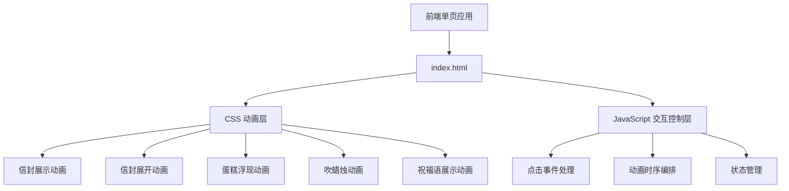
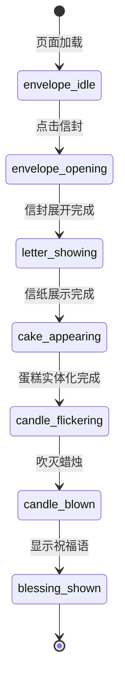

## 1. 架构设计



## 2. 技术选型

| 层级 | 技术 | 说明 |
|------|------|------|
| 前端 | 纯 HTML + CSS + Vanilla JS | 单页面应用，无需框架，所有效果用原生实现 |
| 样式 | 原生 CSS + CSS Variables + CSS Animations | 主题色管理、关键帧动画、过渡效果 |
| 字体 | Google Fonts (ZCOOL XiaoWei / Ma Shan Zheng) | 中文字体，可爱手写风格 |
| 构建 | 无需构建工具 | 静态 HTML 文件直接打开 |

## 3. 路由定义

单页应用，无路由。

## 4. 文件结构

```
生日礼物/
├── index.html          # 主页面，包含所有 HTML/CSS/JS
└── .trae/
    └── documents/
        ├── PRD.md
        └── TECHNICAL_ARCHITECTURE.md
```

## 5. 核心状态机



## 6. 动画时序表

| 阶段 | 动画 | 时长 | 触发方式 |
|------|------|------|----------|
| 引导 | 呼吸光晕循环 | 2s 循环 | 自动循环 |
| 信封打开 | 封口翻折 + 信纸抽出 | 1.5s | 用户点击 |
| 蛋糕浮现 | opacity 0.15 → 1 | 2s | 自动触发 |
| 蜡烛吹灭 | 火焰摇曳 + 熄灭 | 1s | 自动/点击触发 |
| 祝福语 | 文字渐显 + 粒子飘落 | 1.5s | 自动触发 |

## 7. 蛋糕 SVG 设计

- 使用内联 SVG 绘制三层生日蛋糕
- 蛋糕体使用矩形 + 圆角路径
- 奶油层使用波浪路径
- 蜡烛使用矩形 + 椭圆形火焰
- 颜色：蛋糕体 #F5D6C6，奶油 #FFFEF5，草莓装饰 #FF6B6B，蜡烛 #FFB5C5
